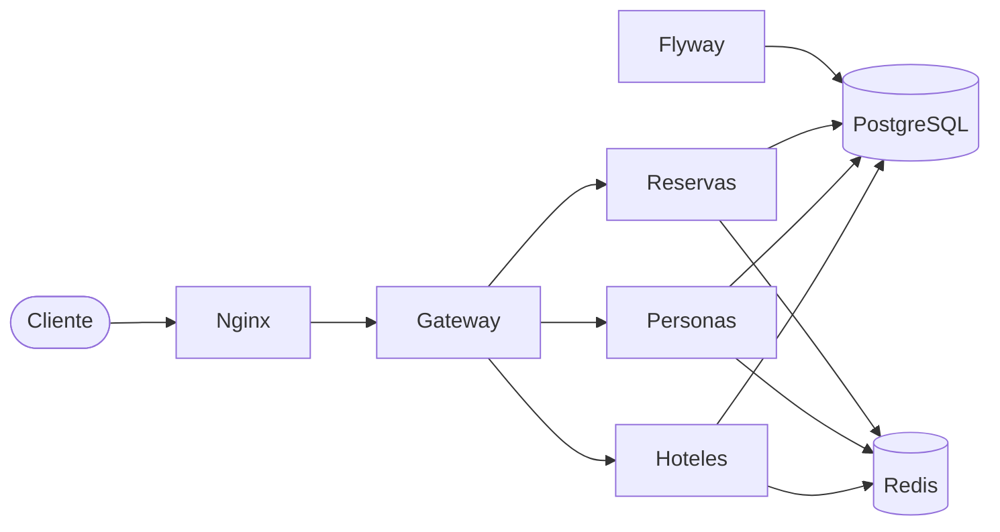

# Hotel Management Backend Platform

Plataforma backend para la gestión de hoteles, clientes y reservas, implementada como arquitectura de microservicios con **Java 21** y **Quarkus**.

El sistema expone una API REST unificada a través de un API Gateway, con persistencia en PostgreSQL, caché distribuida con Redis y despliegue containerizado mediante Docker Compose.

---

## Características

- **Gestión de hoteles**: CRUD completo con validación de estrellas (1–5) y precio por noche.
- **Gestión de personas**: registro, consulta, actualización y eliminación de clientes por DNI.
- **Gestión de reservas**: creación y administración de reservas vinculadas a hoteles y personas, con titular y acompañantes.
- **API Gateway**: punto de entrada único que orquesta las llamadas entre microservicios.
- **Caché con Redis**: capa de caché sobre los repositorios para optimizar lecturas frecuentes.
- **Migraciones con Flyway**: esquema de base de datos versionado y reproducible.
- **Documentación OpenAPI**: especificación y Swagger UI disponibles en el gateway.
- **Reverse proxy con Nginx**: enrutamiento centralizado hacia el gateway en el puerto 80.

---

## Arquitectura



| Módulo      | Responsabilidad                                              |
|-------------|--------------------------------------------------------------|
| `domain`    | Entidades de dominio y excepciones compartidas               |
| `hoteles`   | Microservicio de gestión de hoteles                          |
| `personas`  | Microservicio de gestión de clientes                         |
| `reservas`  | Microservicio de gestión de reservas                         |
| `gateway`   | API Gateway: expone la API pública y coordina los servicios  |
| `nginx`     | Reverse proxy que redirige el tráfico al gateway             |

Cada microservicio sigue una **arquitectura hexagonal** con capas de casos de uso, adaptadores (REST, persistencia) y repositorios.

---

## Stack tecnológico

| Tecnología        | Versión / Uso                          |
|-------------------|----------------------------------------|
| Java              | 21                                     |
| Quarkus           | 3.17.5                                 |
| PostgreSQL        | 16.4                                   |
| Redis             | Bitnami Redis                          |
| Flyway            | Migraciones de base de datos           |
| Nginx             | Reverse proxy                          |
| Docker Compose    | Orquestación de contenedores           |
| Maven             | Gestión de dependencias y build        |
| Lombok            | Reducción de boilerplate               |
| SmallRye OpenAPI  | Documentación de la API                |

---

## Requisitos previos

- [Docker](https://www.docker.com/) y Docker Compose
- [Java 21](https://adoptium.net/) (solo para desarrollo local)
- [Maven 3.9+](https://maven.apache.org/) o usar el wrapper incluido (`./mvnw`)

---

## Inicio rápido con Docker

Clona el repositorio y levanta toda la plataforma:

```bash
git clone https://github.com/<tu-usuario>/Hotel-Management-Backend-Platform.git
cd Hotel-Management-Backend-Platform/Trabajo-I
docker compose -f docker-compose-trabajo-entero.yml up --build
```

Una vez levantados los servicios:

| Recurso              | URL                              |
|----------------------|----------------------------------|
| API (vía Nginx)      | `http://localhost`               |
| Swagger UI           | `http://localhost/swagger`       |
| OpenAPI spec         | `http://localhost/openapi`       |
| Redis                | `localhost:6379`                 |

Para detener los contenedores:

```bash
docker compose -f docker-compose-trabajo-entero.yml down
```

---

## Desarrollo local

### Levantar solo la infraestructura

Si prefieres ejecutar los microservicios en modo desarrollo con Quarkus:

```bash
cd Trabajo-I
docker compose -f docker-compose-trabajo1.yml up -d
```

Esto inicia PostgreSQL, Redis y Flyway. Los microservicios quedan expuestos en:

| Servicio  | Puerto |
|-----------|--------|
| Hoteles   | 8081   |
| Personas  | 8082   |
| Reservas  | 8083   |

### Ejecutar un microservicio en modo dev

```bash
cd Trabajo-I/personas   # o hoteles, reservas, gateway
./mvnw quarkus:dev
```

La Dev UI de Quarkus estará disponible en `http://localhost:8080/q/dev/`.

### Compilar todo el proyecto

```bash
cd Trabajo-I
./mvnw clean package
```

---

## API REST

Todos los endpoints públicos se acceden a través del gateway (puerto 80 con Nginx).

### Hoteles — `/hoteles`

| Método   | Ruta            | Descripción                    |
|----------|-----------------|--------------------------------|
| `GET`    | `/hoteles`      | Listar todos los hoteles       |
| `GET`    | `/hoteles/{id}` | Obtener hotel por ID           |
| `POST`   | `/hoteles`      | Crear un hotel                 |
| `PUT`    | `/hoteles/{id}` | Actualizar un hotel            |
| `DELETE` | `/hoteles/{id}` | Eliminar un hotel              |

**Ejemplo de creación:**

```json
{
  "nombre": "Hotel Salamanca",
  "localizacion": "Salamanca, España",
  "estrellas": 4,
  "precioNoche": 89.50
}
```

### Personas — `/personas`

| Método   | Ruta                  | Descripción                    |
|----------|-----------------------|--------------------------------|
| `GET`    | `/personas`           | Listar todas las personas      |
| `GET`    | `/personas/{dni}`     | Obtener persona por DNI        |
| `POST`   | `/personas`           | Registrar una persona          |
| `PUT`    | `/personas/{dni}`     | Actualizar una persona         |
| `DELETE` | `/personas/{dni}`     | Eliminar una persona           |

**Ejemplo de creación:**

```json
{
  "nombre": "Ana García",
  "fechaNacimiento": "1990-05-15",
  "telefono": "600123456"
}
```

### Reservas — `/reservas`

| Método   | Ruta                        | Descripción                              |
|----------|-----------------------------|------------------------------------------|
| `GET`    | `/reservas/{idReserva}`     | Obtener reserva por ID                   |
| `GET`    | `/reservas/hotel/{id}`      | Listar reservas de un hotel              |
| `POST`   | `/reservas`                 | Crear una reserva                        |
| `PUT`    | `/reservas/{id}`            | Actualizar una reserva                   |
| `DELETE` | `/reservas/{id}`            | Eliminar una reserva                     |

**Ejemplo de creación:**

```json
{
  "dni": "12345678A",
  "id_hotel": "H0001",
  "DNITitular": "12345678A",
  "fechaEntrada": "2026-08-01",
  "fechaSalida": "2026-08-05",
  "precioTotal": 358.00
}
```

---

## Modelo de datos

```
HOTELES (ID, NOMBRE, LOCALIZACION, ESTRELLAS, PRECIO_NOCHE)
    ↑
    │ FK
RESERVAS (ID, DNI, ID_HOTEL, TITULAR_DNI, FECHA_ENTRADA, FECHA_SALIDA, PRECIO)
    ↑                    ↑
    │ FK                 │ FK
PERSONAS (DNI, NOMBRE, FECHA_NACIMIENTO, TELEFONO)
```

Las migraciones Flyway se encuentran en `Trabajo-I/<servicio>/flyway/` y se ejecutan automáticamente al levantar Docker Compose.

---

## Variables de entorno

| Variable               | Descripción                          | Valor por defecto (Docker)     |
|------------------------|--------------------------------------|--------------------------------|
| `DATABASE_HOST`        | Host de PostgreSQL                   | `database`                     |
| `DATABASE_PORT`        | Puerto de PostgreSQL                 | `5432`                         |
| `DATABASE_NAME`        | Nombre de la base de datos           | `upsa`                         |
| `DATABASE_USER`        | Usuario de la base de datos          | `system`                       |
| `DATABASE_PASSWORD`    | Contraseña de la base de datos       | `manager`                      |
| `REDIS_HOSTS`          | URL de conexión a Redis              | `redis://cache-redis:6379`     |
| `REDIS_TYPE`           | Tipo de despliegue Redis             | `standalone`                   |
| `SERVICE_HOTELES_URL`  | URL interna del servicio hoteles     | `http://hoteles:8080`          |
| `SERVICE_PERSONAS_URL` | URL interna del servicio personas    | `http://personas:8080`         |
| `SERVICE_RESERVAS_URL` | URL interna del servicio reservas    | `http://reservas:8080`         |

---

## Estructura del proyecto

```
Hotel-Management-Backend-Platform/
└── Trabajo-I/
    ├── domain/                  # Entidades y excepciones compartidas
    ├── hoteles/                 # Microservicio de hoteles
    ├── personas/                # Microservicio de personas
    ├── reservas/                # Microservicio de reservas
    ├── gateway/                 # API Gateway
    ├── nginx/                   # Configuración del reverse proxy
    ├── docker-compose-trabajo-entero.yml   # Stack completo
    ├── docker-compose-trabajo1.yml         # Solo infraestructura
    └── pom.xml                  # POM padre Maven
```

---

## Licencia

Este proyecto fue desarrollado como trabajo académico en el marco de la asignatura de Sistemas de Información (UPSA).
