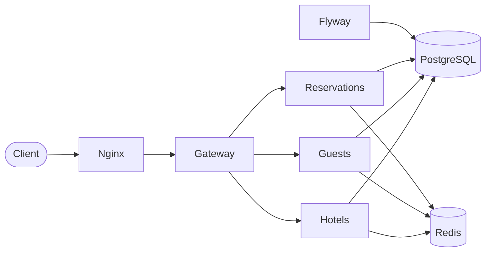

# Hotel Management Backend Platform

A microservices-based backend for managing hotels, guests, and reservations. Built with **Java 21** and **Quarkus**, it exposes a unified REST API through an API Gateway, persists data in **PostgreSQL**, caches reads with **Redis**, and ships with **Docker Compose** for local deployment.

---

## Features

- **Hotel management** — Full CRUD with star rating validation (1–5) and nightly pricing.
- **Guest management** — Register, query, update, and delete guests by national ID (DNI).
- **Reservation management** — Create and manage bookings linked to hotels and guests, with a holder and accompanying guests.
- **API Gateway** — Single entry point that orchestrates calls across microservices.
- **Redis caching** — Repository-level cache layer to optimize frequent reads.
- **Flyway migrations** — Versioned, reproducible database schema.
- **OpenAPI documentation** — Spec and Swagger UI served from the gateway.
- **Nginx reverse proxy** — Centralized routing to the gateway on port 80.

---

## Architecture



| Module          | Responsibility                                              |
|-----------------|-------------------------------------------------------------|
| `domain`        | Shared domain entities and exceptions                       |
| `hoteles`       | Hotels microservice                                         |
| `personas`      | Guests microservice                                         |
| `reservas`      | Reservations microservice                                   |
| `gateway`       | API Gateway — public API and cross-service orchestration    |
| `nginx`         | Reverse proxy forwarding traffic to the gateway             |

Each microservice follows a **hexagonal architecture** with use cases, adapters (REST, persistence), and repositories.

---

## Tech Stack

| Technology       | Version / Role                    |
|------------------|-----------------------------------|
| Java             | 21                                |
| Quarkus          | 3.17.5                            |
| PostgreSQL       | 16.4                              |
| Redis            | Bitnami Redis                     |
| Flyway           | Database migrations               |
| Nginx            | Reverse proxy                     |
| Docker Compose   | Container orchestration           |
| Maven            | Dependency management and builds  |
| Lombok           | Boilerplate reduction             |
| SmallRye OpenAPI | API documentation                 |

---

## Prerequisites

- [Docker](https://www.docker.com/) and Docker Compose
- [Java 21](https://adoptium.net/) (for local development)
- [Maven 3.9+](https://maven.apache.org/) or the included Maven Wrapper (`./mvnw`)

---

## Quick Start (Full Stack)

### 1. Clone the repository

```bash
git clone https://github.com/<your-username>/Hotel-Management-Backend-Platform.git
cd Hotel-Management-Backend-Platform/Trabajo-I
```

### 2. Build all services

Docker images expect pre-built Quarkus artifacts. Install the shared `domain` module first, then package each service:

```bash
# Install shared domain module
cd domain && mvn clean install && cd ..

# Package microservices
cd hoteles   && ./mvnw clean package && cd ..
cd personas  && ./mvnw clean package && cd ..
cd reservas  && ./mvnw clean package && cd ..
cd gateway   && ./mvnw clean package && cd ..
```

### 3. Start the platform

```bash
docker compose -f docker-compose-trabajo-entero.yml up --build
```

### 4. Access the services

| Resource       | URL                              |
|----------------|----------------------------------|
| API (via Nginx)| `http://localhost`               |
| Swagger UI     | `http://localhost/swagger`       |
| OpenAPI spec   | `http://localhost/openapi`       |
| Redis          | `localhost:6379`                 |

To stop the containers:

```bash
docker compose -f docker-compose-trabajo-entero.yml down
```

---

## Local Development

### Start infrastructure only

To run microservices locally with Quarkus dev mode, start the backing services first:

```bash
cd Trabajo-I
docker compose -f docker-compose-trabajo1.yml up -d
```

This starts PostgreSQL, Redis, and Flyway. Microservices are mapped to the following host ports:

| Service       | Host port | Internal port |
|---------------|-----------|-----------------|
| Hotels        | 81        | 8081            |
| Guests        | 82        | 8082            |
| Reservations  | 83        | 8083            |

### Run a microservice in dev mode

Each service uses a dedicated port defined in `application.properties`:

| Service       | Port |
|---------------|------|
| Hotels        | 8081 |
| Guests        | 8082 |
| Reservations  | 8083 |
| Gateway       | 8084 |

```bash
cd Trabajo-I/personas   # or hoteles, reservas, gateway
./mvnw quarkus:dev
```

Quarkus Dev UI is available at `http://localhost:<port>/q/dev/`.

When running the gateway locally, it expects the other services at `http://localhost:8081`, `8082`, and `8083` (configured in `gateway/src/main/resources/application.properties`).

---

## REST API

All public endpoints are accessed through the gateway. With the full Docker stack, use the Nginx entry point on port 80.

### Hotels — `/hoteles`

| Method   | Path            | Description          |
|----------|-----------------|----------------------|
| `GET`    | `/hoteles`      | List all hotels      |
| `GET`    | `/hoteles/{id}` | Get hotel by ID      |
| `POST`   | `/hoteles`      | Create a hotel       |
| `PUT`    | `/hoteles/{id}` | Update a hotel       |
| `DELETE` | `/hoteles/{id}` | Delete a hotel       |

**Create example:**

```json
{
  "nombre": "Hotel Salamanca",
  "localizacion": "Salamanca, Spain",
  "estrellas": 4,
  "precioNoche": 89.50
}
```

### Guests — `/personas`

| Method   | Path                    | Description           |
|----------|-------------------------|-----------------------|
| `GET`    | `/personas`             | List all guests       |
| `GET`    | `/personas/{dni}`       | Get guest by DNI      |
| `POST`   | `/personas`             | Register a guest      |
| `PUT`    | `/personas/{dni}`       | Update a guest        |
| `DELETE` | `/personas/{dni}`       | Delete a guest        |

**Create example:**

```json
{
  "dni": "12345678A",
  "nombre": "Ana Garcia",
  "fechaNacimiento": "1990-05-15",
  "telefono": "600123456"
}
```

### Reservations — `/reservas`

| Method   | Path                   | Description                    |
|----------|------------------------|--------------------------------|
| `GET`    | `/reservas/{id}`       | Get reservation by ID          |
| `GET`    | `/reservas/hotel/{id}` | List reservations for a hotel  |
| `POST`   | `/reservas`            | Create a reservation           |
| `PUT`    | `/reservas/{id}`       | Update a reservation           |
| `DELETE` | `/reservas/{id}`       | Delete a reservation           |

**Create example** (using seed data IDs):

```json
{
  "dni": "70918645P",
  "id_hotel": "00001",
  "DNITitular": "70918645P",
  "fechaEntrada": "2026-08-01",
  "fechaSalida": "2026-08-05",
  "precioTotal": 358.00
}
```

---

## Data Model

```
HOTELES (ID, NOMBRE, LOCALIZACION, ESTRELLAS, PRECIO_NOCHE)
    ↑
    │ FK
RESERVAS (ID, DNI, ID_HOTEL, TITULAR_DNI, FECHA_ENTRADA, FECHA_SALIDA, PRECIO)
    ↑                    ↑
    │ FK                 │ FK
PERSONAS (DNI, NOMBRE, FECHA_NACIMIENTO, TELEFONO)
```

Flyway migration scripts live under `Trabajo-I/<service>/flyway/` and run automatically when using Docker Compose.

---

## Environment Variables

Quarkus maps environment variables to configuration properties automatically (e.g. `DATABASE_HOST` → `database.host`).

| Variable               | Description                       | Default (Docker)               |
|------------------------|-----------------------------------|--------------------------------|
| `DATABASE_HOST`        | PostgreSQL host                   | `database`                     |
| `DATABASE_PORT`        | PostgreSQL port                   | `5432`                         |
| `DATABASE_NAME`        | Database name                     | `upsa`                         |
| `DATABASE_USER`        | Database user                     | `system`                       |
| `DATABASE_PASSWORD`    | Database password                 | `manager`                      |
| `REDIS_HOSTS`          | Redis connection URL              | `redis://cache-redis:6379`     |
| `REDIS_TYPE`           | Redis deployment type             | `standalone`                   |
| `SERVICE_HOTELES_URL`  | Internal hotels service URL       | `http://hoteles:8080`          |
| `SERVICE_PERSONAS_URL` | Internal guests service URL       | `http://personas:8080`         |
| `SERVICE_RESERVAS_URL` | Internal reservations service URL | `http://reservas:8080`         |

---

## Project Structure

```
Hotel-Management-Backend-Platform/
└── Trabajo-I/
    ├── domain/                             # Shared entities and exceptions
    ├── hoteles/                            # Hotels microservice
    ├── personas/                           # Guests microservice
    ├── reservas/                           # Reservations microservice
    ├── gateway/                            # API Gateway
    ├── nginx/                              # Reverse proxy configuration
    ├── docker-compose-trabajo-entero.yml   # Full stack (all services + Nginx)
    ├── docker-compose-trabajo1.yml         # Infrastructure only (DB, Redis, Flyway)
    └── pom.xml                             # Parent Maven POM
```

---

## License

This project was developed as an academic assignment for the Information Systems course at UPSA (Universidad Pontificia de Salamanca).
